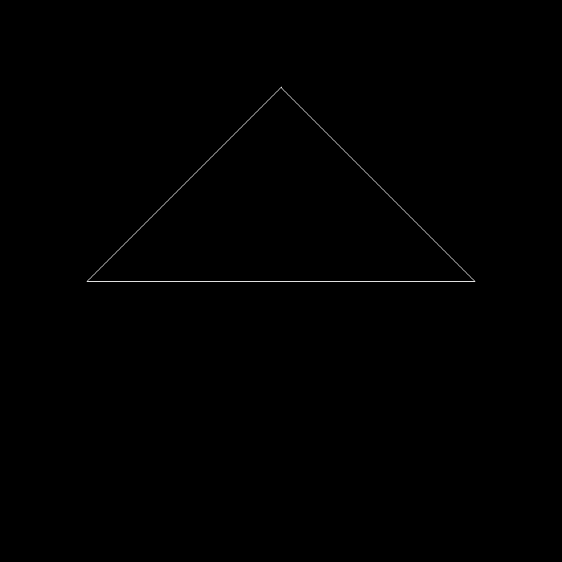
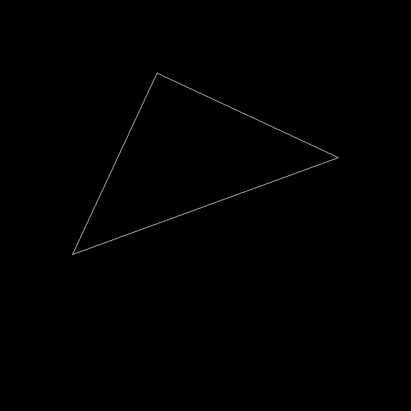
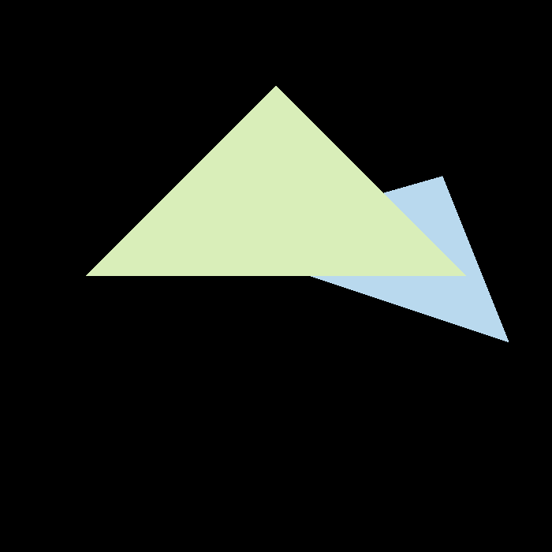

# GAMES101 PA

Personal PA repo for UCSB GAMES101 course.

## PA1: Rotation and Projection

The left image shows the original triangle without model rotation. The right
image shows the triangle after a 20-degree rotation around the z-axis.

  
  

## PA2: Triangles and Z-buffering

The left image uses ordinary single-sample triangle rasterization. The right
image uses 2x2 MSAA to reduce jagged edges along the triangle boundaries.

  
  

